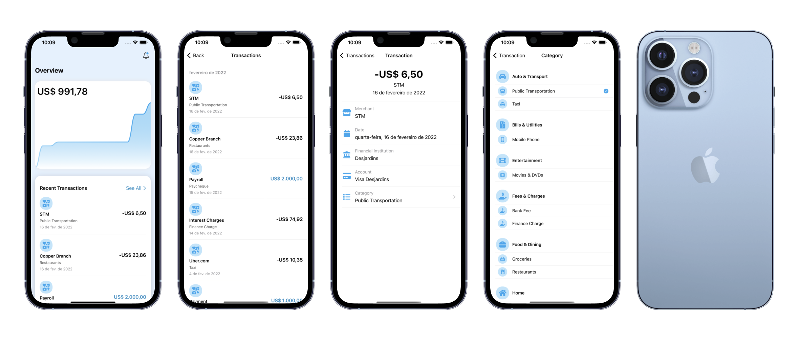

Design and code a SwiftUI 3 app in Xcode 13 with data modeling, data networking, Combine, MVVM and libraries for custom icons and charts. Also, visualize data in interactive chart.

## What you'll build

In this repository, we will be building an expense tracker app. This app is inspired by Mint, a free tool to track your spending, income, bills and budget, all in one place. You can also view all of your account balances and net worth. What’s awesome is that since it connects to your banks, you don’t have to enter any transaction entries manually. I use it everyday for managing my personal finances and it has been great. Recently, Mint has been putting a lot of efforts into revamping their app. They really brought it up a notch.

## Transaction Row and Model

We’ll set up the data model for the transaction as well as compose test data for the previews. Then, we’ll move on to design the view for the transaction row. We will program many extension methods in order to display information in the correct format, such as **date formatter** and string to date converter. Finally, we’ll install an icon library and use their icons to identify the category, which will add a **nice touch to the UI**.

## Data

We will set up a class that will manage the call to the API via Combine and save the returned data into a state property to be read throughout our app.
Once the data is fetched, we are apt to inject them into our views. Precisely, we’ll implement the design of the recent transactions card. Additionally, the icon that was previously attached to the transaction row was fixed, so we’ll need to turn them dynamic by mapping each transaction category with a specific icon.
We’ll manipulate the transactions data again to extract the expenses only in order to determine the history of cumulative total expenses per day within the current month, and showcase them in the line chart.
